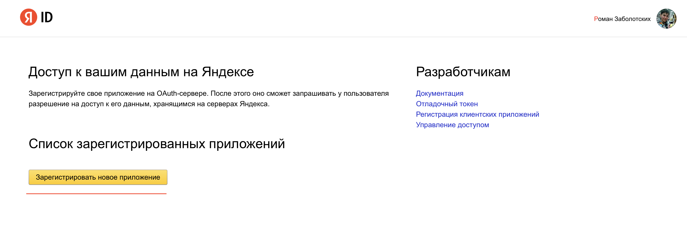
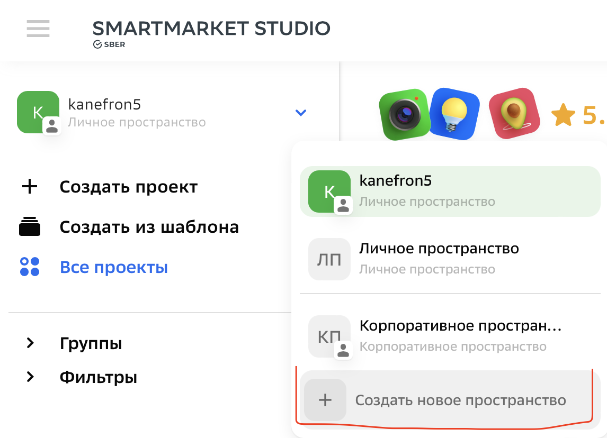
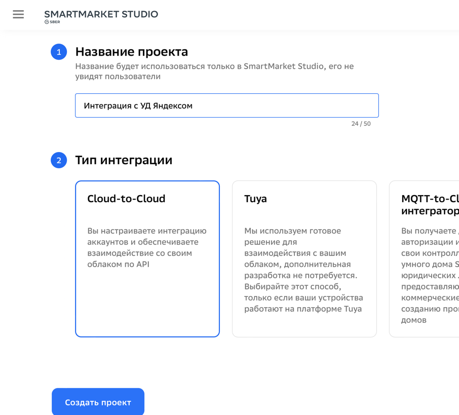
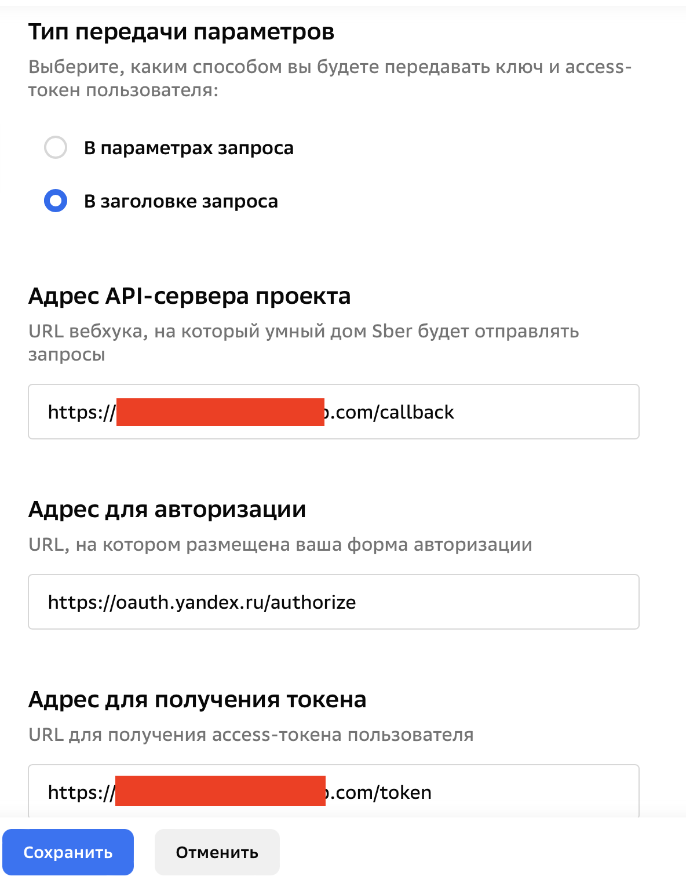
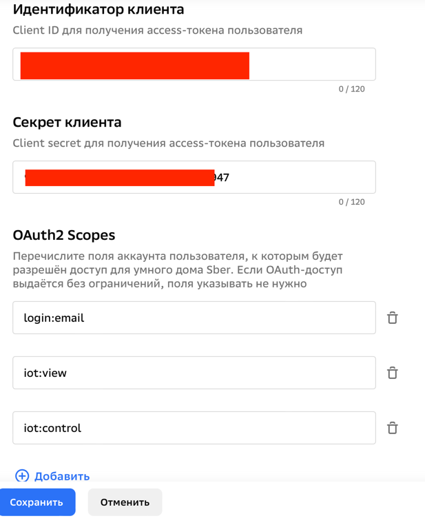

# Инструкция по прокидыванию устройств из умного дома Яндекса в умный дом Сбера
## Предисловие

Способ очень костыльный, потому что в УД Сбера пока что поддерживается мало типов устройств, и сравнительно медленный, потому что требует пройти через минимум через 3 облака, прежде чем достучаться до целевого устройства. Однако, пока УД Сбера не поддерживает большой спектр производителей устройств, это лучше, чем ничего. Также способ требует базовых навыков программирования на любом языке написания бэкендов. Далее все примеры будут на Kotlin с использованием Spring Boot.

## Полезные ссылки

- [Докуметация Сбера](https://developers.sber.ru/docs/ru/smarthome/overview "Докуметация Сбера")
- [Кабинет разработчика Сбера](https://developers.sber.ru/studio/login "Кабинет разработчика Сбера")
- [Кабинет разработчика Яндекса](https://oauth.yandex.ru "Кабинет разработчика Яндекса")
- [Документация Яндекса по авторизации](https://yandex.ru/dev/id/doc/dg/oauth/concepts/about.html "Документация Яндекса по авторизации")
- [Документация Яндекса по API Умного дома](https://yandex.ru/dev/dialogs/smart-home/doc/concepts/platform-quickstart.html "Документация Яндекса по API Умного дома")


## Создание приложения в Яндексе

Заходим на [страницу создания приложений](https://oauth.yandex.ru "страницу создания приложений") в Яндексе, входим в свой аккаунт и в самом низу страницы нажимаем кнопку "**Зарегистрировать новое приложение**"



Названием вводим любое.

Далее в разделе платформы выбираем галочку Веб-сервисы и в качестве Callback URI вводим `https://gateway.iot.sberdevices.ru/gateway/v1/binder/backward`.

Ставим галочку "API авторизации в Яндекс.Браузере и Приложении Яндекс" и вводим в поле "Домен сайта": `https://alcanvas.iot.sberdevices.ru`. 

В разделе "Доступы" необходимо раскрыть секцию "API Яндекс ID" и отметить там галочкой "Доступ к адресу электронной почты". В секции "Умный дом Яндекса" нужно выбрать галочки "Просмотр списка устройств умного дома" и "Управление устройствами умного дома".

Дальше в самом низу нажимаем кнопку "Создать приложение". Далее откроется страница с описанием приложения и данными для подключения к нему. Страницу не закрываем, она нам еще потребуется.

## Создание проекта в SmartMarket Studio

Открываем [студию](https://developers.sber.ru/studio/login), нажимаем войти по Сбер ID.
После успешного входа нужно создать новое корпоративное пространство (возможно получится и в личном, но в документации написано так).


Заполняем любое имя и описание, на модерацию не отправляем.

После создания пространства нажимаем кнопку "Создать проект" и в самом низу выбираем тип "Smart Home". На следующей странице вводим любое название и выбираем тип интеграции Cloud-to-Cloud. После этого нажимаем кнопку "Создать проект".



## Настройка интеграции

В созданном на прошлом шаге проекте вводим любое название и нажимаем кнопку "сохранить".

Открываем вкладку "Параметры" и вводим там данные:

| Параметр                                | Значение                                                             |
|-----------------------------------------|----------------------------------------------------------------------|
| Тип передачи параметров                 | В заголовке запроса                                                  |
| Адрес API-сервера проекта               | URL, на котором будет запущен сервер                                 |
| Адрес для авторизации                   | `https://oauth.yandex.ru/authorize`                                  |
| Адрес для получения токена              | URL, на котором будет запущен сервер и эндпоинт для получения токена |
| Идентификатор клиента                   | ID, указанный на странице созданного приложения в Яндексе            |
| Секрет клиента                          | Пароль, указанный на странице созданного приложения в Яндексе        |
| OAuth2 Scopes (По одному в каждом поле) | login:email, iot:view, iot:control                                   |





Нажимаем кнопку "Сохранить". После этого созданная интеграция должна появиться в приложении "Салют" в разделе "Добавление нового устройства" - "Устройства других производителей".


## Настройка сервера
Веб сервер должен иметь белый IP и предположительно SSL сертификаты, которые можно получить с помощью LetsEncrypt. 
В ином случае, если у вас нет своего сервера или вы не хотите платить на виртуальный, то можно воспользоваться Heroku или Vercel, которые позволяют разместить до 5 серверов бесплатно. Однако такой способ менее безопасный и более медленный, поскольку сервера находятся не в РФ.

На вашем сервере необходимо реализовать следующее эндпоинты:
- POST /token - преобразование Ouauth Code, выданного яндексом в access_token
- GET /v1/ping - состояние вашего сервиса
- GET /v1/user - получение информации о пользователе
- GET /v1/devices - получение списка устройств пользователя
- GET /v1/command - отправка команды на устройство пользователя

### /token
POST запрос, который отправляет сервер УД Сбера на ваш WEB Api, в заголовке `Authorization` приходят закодированные в Base64 client_id и secret_id приложения Яндекса, а в параметре `code` приходит код, который необходимо обменять на токен.

Подробная информация описана [здесь](https://yandex.ru/dev/id/doc/dg/oauth/reference/auto-code-client.html#auto-code-client)

Нужно отправить POST запрос на `https://oauth.yandex.ru/token`, в заголовках передать `authorization` - значение, пришедшее к вам на эндпоинт в этом же заголовке, и `Content-Type: application/x-www-form-urlencoded`.

В параметрах POST запроса надо отправить `grant_type=authorization_code` и `code` - полученный из параметров запроса код.

Если все успешно, то сервер Яндекса вернет Access Token, который нужно вернуть в таком же формате серверу Сбера.

Пример на Spring Boot:

```kotlin
@PostMapping(value = ["token"], produces = ["application/json"])
fun execute(
    @RequestHeader authorization: String,
    @RequestParam(required = true) code: String,
): ResponseEntity<String> {
    val tokenResponse: YandexTokenResponse = RestTemplate().exchange<YandexTokenResponse>(
        url = "https://oauth.yandex.ru/token",
        method = HttpMethod.POST,
        requestEntity = HttpEntity(LinkedMultiValueMap<String, String>().apply {
            add("grant_type", "authorization_code")
            add("code", code)
        }, HttpHeaders().apply {
            contentType = MediaType.APPLICATION_FORM_URLENCODED
            this["authorization"] = authorization
        })
    ).body ?: throw RuntimeException()
    return ResponseEntity.ok(Gson().toJson(tokenResponse))
}
```

### /v1/user
После получения токена, сервер Сбера отправляет запрос на этот эндпоинт. Он должен возвращать строку вида `{"id": "user_id"}`, сюда можно захардкодить любую строку, если вы собираетесь пользоваться интеграцией в одиночку (а сбер не пропустит ее для публичного использования).

Пример на Spring Boot:
```kotlin
data class SberUser(
    val id: String
)

@GetMapping(value = ["/callback/v1/user"], produces = ["application/json"])
fun user(@RequestHeader(name = "X-Request-Id") requestId: String) =
    ResponseEntity.ok(gson.toJson(SberUser("kanefron5")))
```

### /v1/ping
Должен возвращать 200 OK, если интеграция жива
```kotlin
@GetMapping(value = ["/callback/v1/ping"], produces = ["application/json"])
    fun ping(req: HttpServletRequest) = ResponseEntity.ok("")
```

### /v1/devices
Самое интересное. Здесь нужно получить список устройств с УД Яндекса и конвертировать их в формат УД Сбера.

Для получения списка устройств Яндекса нужно отправить GET запрос на `https://api.iot.yandex.net/v1.0/user/info`, а в заголовке `Authorization` указать токен, который приходит от сервера Сбера на текущий эндпоинт.

Затем полученные данные нужно конвертировать в [формат](https://developers.sber.ru/docs/ru/smarthome/c2c/webhook-get-devices), который ожидает получить сервер Сбера:

Пример на Spring Boot. В данном примере все устройства будут распознаваться Сбером как розетки с функцией только Вкл-Выкл. Протестировано на чайнике Redmond:
```kotlin
data class YaCaptabilityState(
    val instance: String,
    val value: Any
)

data class YaCaptability(
    val type: String,
    val state: YaCaptabilityState,
    val last_updated: Double
)

data class SberDeviceModel(
    val id: String = "1",
    val manufacturer: String,
    val model: String,
    val category: String = "socket",
    val features: ArrayList<String> = arrayListOf("on_off", "online", "power"),
)

data class SberDevice(
    val id: String,
    val name: String,
    val default_name: String,
    val model: SberDeviceModel = SberDeviceModel(manufacturer = "Yandex", model = "YDX"),
)

data class YaDevice(
    val id: String,
    val name: String,
    val type: String,
    val external_id: String,
    val capabilities: ArrayList<YaCaptability>,
    val properties: ArrayList<YaCaptability>
) {
    fun toSberDevice() = SberDevice(id, name, name)
}

data class YaDeviceResponse(
    val status: String,
    val request_id: String,
    val devices: ArrayList<YaDevice>
)

@GetMapping(value = ["/callback/v1/devices"], produces = ["application/json"])
    fun devices(
        @RequestHeader(name = "X-Request-Id") requestId: String,
        @RequestHeader authorization: String,
        @RequestParam(required = false, defaultValue = "", name = "device_ids") deviceIds: String,
    ): ResponseEntity<String> {
        val devices: YaDeviceResponse = RestTemplate().exchange<YaDeviceResponse>(
            url = "https://api.iot.yandex.net/v1.0/user/info",
            method = HttpMethod.GET,
            requestEntity = HttpEntity("", HttpHeaders().apply {
                this["authorization"] = authorization
            })
        ).body ?: throw RuntimeException()

        return ResponseEntity.ok(Gson().toJson(SberDevicesResponse(devices.devices.map { it.toSberDevice() })))
    }
```


### /v1/command
На данный эндпоинт приходит запрос при нажатии кнопки в приложении Салют для изменения состояния прибора.

Запрос приходит в [таком](https://developers.sber.ru/docs/ru/smarthome/c2c/webhook-post-command) формате, а преобразовать его нужно в [такой](https://yandex.ru/dev/dialogs/smart-home/doc/reference/post-action.html).
Важно, чтобы у устройства Яндекса была функция `devices.capabilities.on_off`, иначе работать ничего не будет.

В качестве ответа на сервер Сбера необходимо вернуть либо новое состояние устройства, либо пустой объект.
При отправке запроса на сервер Яндекса, он отвечает, получилось ли изменить состояние в поле state.action_result массива capabilities девайса. Если статус `DONE`, то смело можно возвращать серверу Сбера новое состояние.


Пример
```kotlin
@PostMapping(value = ["/callback/v1/command"], produces = ["application/json"])
    fun deviceCommand(
        @RequestHeader(name = "X-Request-Id") requestId: String,
        @RequestHeader authorization: String,
        @RequestBody body: CommandRequest,
    ): ResponseEntity<String> {
        val changeStateRequest = RestTemplate().exchange<String>(
            url = "https://api.iot.yandex.net/v1.0/devices/actions",
            method = HttpMethod.POST,
            requestEntity = HttpEntity("""
                {
                	"devices": [{
                		"id": "${body.devices.keys.toTypedArray()[0]}",
                		"actions": [{
                			"type": "devices.capabilities.on_off",
                			"state": {
                                "instance": "on",
                                "value": ${body.devices.values.toTypedArray()[0].states[0].value.bool_value}
                            }
                		}]
                	}]
                }
            """.trimIndent(), HttpHeaders().apply {
                this["authorization"] = authorization
                contentType = MediaType.APPLICATION_JSON
            })
        ).body ?: throw RuntimeException()
        val find = gson.fromJson(changeStateRequest, JsonObject::class.java)
            .get("devices").asJsonArray.get(0).asJsonObject
            .get("capabilities").asJsonArray
            .find { it.asJsonObject["type"].asString == "devices.capabilities.on_off" }
            ?.asJsonObject?.get("state")?.asJsonObject

        val success = find?.get("action_result")?.asJsonObject?.get("status")?.asString == "DONE"

        return ResponseEntity.ok(
            if (success) JsonObject().apply {
                add("devices", gson.toJsonTree(body.devices))
            }.toString()
            else "{}"
        )
    }
```

## Реализация poll'инга состояния с сервера Яндекса
Для того, чтобы состояние проброшенных устройств периодически обновялось в приложении Салют, например, когда вы вручную включили прибор, необходимо сделать сервис, который будет периодически запрашивать состояние устройств и пересылать их на сервер Сбера.
Для этого нужно получить список всех устройств `https://api.iot.yandex.net/v1.0/user/info`, конвертировать его в нужный [формат] (https://developers.sber.ru/docs/ru/smarthome/c2c/api-post-state) и отправить список на эндпоинт `https://partners.iot.sberdevices.ru/v1/state`.
Важно, что для выполнения этих двух запросов нужен токен, который нужно передать через переменную окружения, либо захардкодить (НЕБЕЗОПАСНО), а так же ключ для API Сбера, который можно найти в настройке интеграции в студии во вкладке "Доступ к API".

Данное действие нужно периодечески повторять, например раз в 5 секунд, чтобы информация в приложении Салют была всегда актуальной.

Пример:
```kotlin
@Service
@Component
class DeviceStatusService {
    companion object {
        private const val CHECK_INTERVAL_SECONDS = 5
        var YANDEX_AUTHORIZATION = ""
        var SBER_AUTHORIZATION = ""
    }

    private val gson = Gson()

    @Scheduled(fixedRate = CHECK_INTERVAL_SECONDS * 1000L)
    fun check() {
        val currentThread = Thread.currentThread()
        currentThread.name = "DeviceStatusService"

        try {
            val devices: YaDeviceResponse = RestTemplate().exchange<YaDeviceResponse>(
                url = "https://api.iot.yandex.net/v1.0/user/info",
                method = HttpMethod.GET,
                requestEntity = HttpEntity("", HttpHeaders().apply {
                    setBearerAuth(YANDEX_AUTHORIZATION)
                })
            ).body ?: throw RuntimeException()


            val map = mutableMapOf<String, CommandRequestDeviceState>()
            devices.devices.forEach { it ->
                val capatability = it.capabilities.find { it.type == "devices.capabilities.on_off" }
                val temperatureCapatability = it.properties.find { it.type == "devices.properties.float" }

                val b = capatability?.state?.value as Boolean?
                var online = false

                if (capatability != null) {
                    val lastUpdate = (capatability.last_updated * 1000).toLong()
                    online = (System.currentTimeMillis() - lastUpdate) < 300_000
                }

                map[it.id] = CommandRequestDeviceState(
                    arrayListOf(
                        SberDeviceState(
                            "on_off",
                            SberDeviceStateValue("BOOL", bool_value = b ?: false)
                        ),
                        SberDeviceState(
                            "online",
                            SberDeviceStateValue("BOOL", bool_value = online)
                        ),
                        SberDeviceState(
                            "power",
                            SberDeviceStateValue(
                                "INTEGER",
                                integer_value = temperatureCapatability?.state?.value as Int? ?: -1
                            )
                        )
                    )
                )
            }
            val sberObject = JsonObject().apply {
                add("devices", gson.toJsonTree(map))
            }

            RestTemplate().exchange<String>(
                url = "https://partners.iot.sberdevices.ru/v1/state",
                method = HttpMethod.POST,
                requestEntity = HttpEntity(sberObject.toString(), HttpHeaders().apply {
                    setBearerAuth(SBER_AUTHORIZATION)
                })
            ).body ?: throw RuntimeException()

        } catch (e: Exception) {
            e.printStackTrace()
        }
    }

}
```